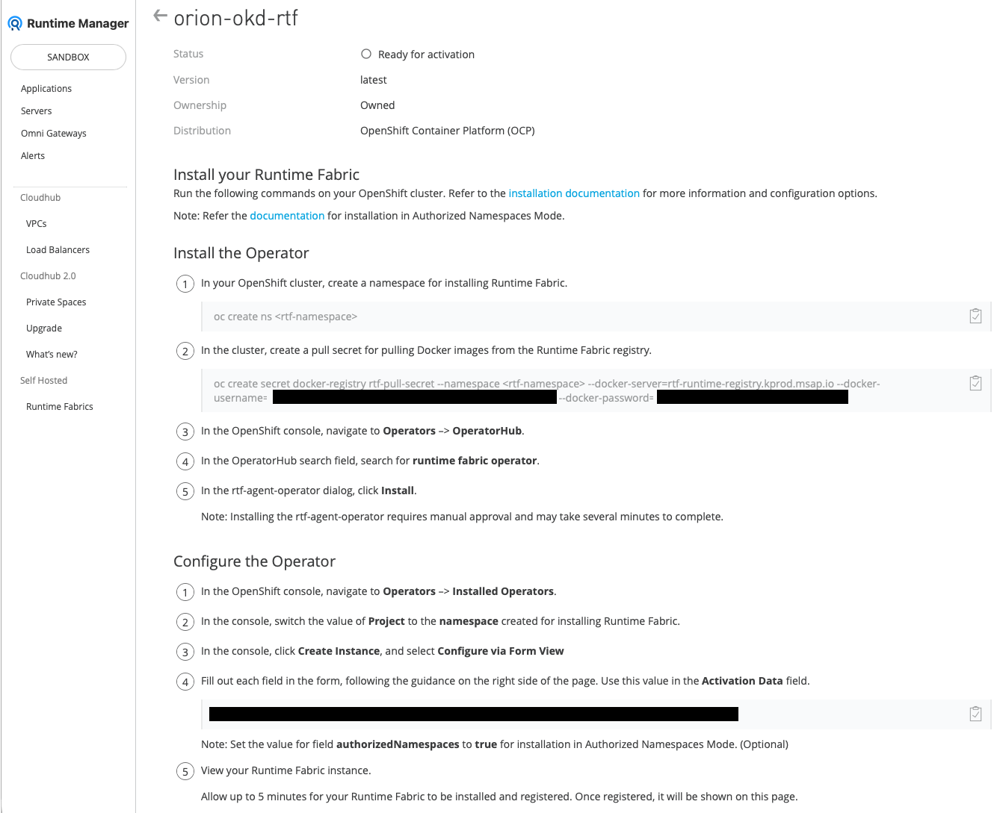
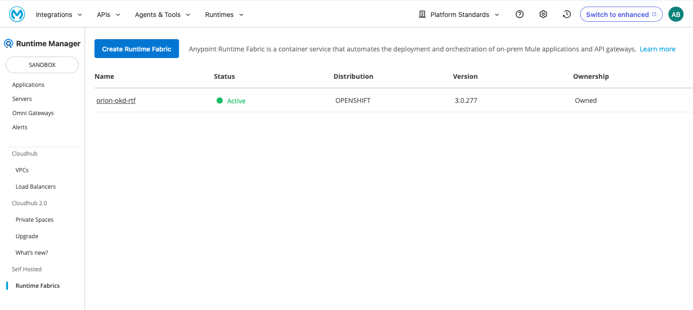
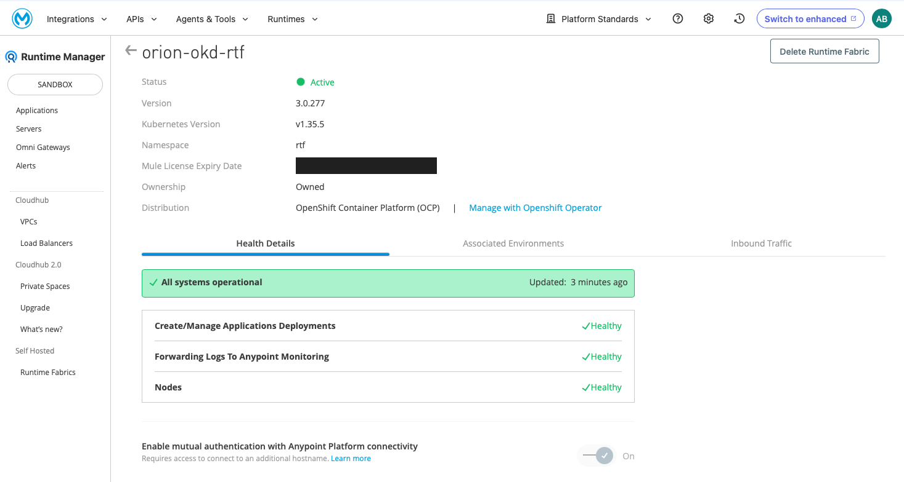
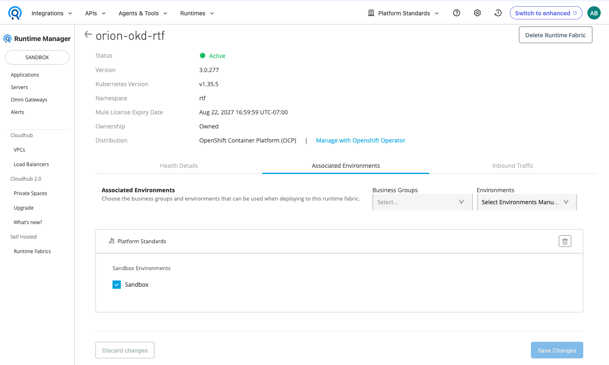

# Installing Anypoint Runtime Fabric

## 1. Purpose

Install Anypoint Runtime Fabric (RTF) on the prepared OKD Single Node OpenShift (SNO) cluster.

> [!WARNING]
> **Supportability Notice**
>
> This guide demonstrates how to install Anypoint Runtime Fabric on an OKD Single Node OpenShift cluster for learning, experimentation, and proof-of-concept purposes.
>
> OKD is not a MuleSoft-certified or supported platform for Anypoint Runtime Fabric. Issues encountered while running Runtime Fabric on OKD are outside the scope of MuleSoft Support.
>
> For a supported deployment, use a MuleSoft-supported Kubernetes distribution and version, such as a supported release of Red Hat OpenShift Container Platform.

## 2. Installation Requirements

Before proceeding, ensure the following requirements have been met:

- The OKD Single Node OpenShift cluster has been installed as described in **Installing OKD**.
- The OKD virtual machine meets the validated sizing described in `AA-configuration-reference.md`.
- The cluster has outbound connectivity to the hostnames and ports listed in MuleSoft’s [Runtime Fabric network configuration requirements](https://docs.mulesoft.com/runtime-fabric/latest/install-self-managed-network-configuration).
- You have access to Runtime Manager in the Anypoint Platform root organization or in at least one business group.
- You have permission to create and manage Runtime Fabrics in Runtime Manager.
- You have `cluster-admin` privileges in OKD.
- The clean OKD virtual machine disk has been backed up.
- You have Red Hat credentials that can authenticate to `registry.connect.redhat.com` and retrieve the certified Runtime Fabric Operator bundle.

## 3. Start and Verify the OKD Cluster

Start the OKD virtual machine and verify that the cluster is healthy before installing Runtime Fabric.

### 3.1 Start the Virtual Machine

Start the OKD virtual machine.

##### Procedure

```bash
sudo virsh start okd-sno
```

##### Verification

Monitor the virtual machine until its state is `running`.

```bash
watch -n 5 'sudo virsh list --all'
```

Example output:

```text
 Id   Name      State
--------------------------
 1    okd-sno   running
```

Press `Ctrl+C` to stop monitoring.

### 3.2 Verify the OKD Cluster

Configure the OpenShift client to access the cluster.

```bash
export KUBECONFIG=~/Work/rtf-on-okd/cluster/auth/kubeconfig
```

Monitor the node until it reports `Ready`.

```bash
watch -n 15 'oc get nodes'
```

Continue when the node reports `Ready` and lists the `control-plane`, `master`, and `worker` roles, and then press `Ctrl+C` to stop monitoring.

Example output:

```text
NAME      STATUS   ROLES                         AGE
okd-sno   Ready    control-plane,master,worker
```

Verify that all cluster operators are available and are not progressing or degraded.

```bash
oc get clusteroperators
```

Confirm that:

- All cluster operators show `True` in the `AVAILABLE` column.
- All cluster operators show `False` in the `PROGRESSING` column.
- All cluster operators show `False` in the `DEGRADED` column.

Verify that the default Ingress Controller is available.

```bash
oc get ingresscontroller default \
    -n openshift-ingress-operator \
    -o jsonpath='{.status.conditions[?(@.type=="Available")].status}{"\n"}'
```

Confirm that the command returns `True`.

> [!NOTE]
> On Orion, the virtual machine reaches the `running` state almost immediately, and the OKD Single Node OpenShift cluster typically becomes fully operational within approximately 5 to 6 minutes. Startup time may vary depending on the host system and workload. Always rely on the verification steps in this guide rather than elapsed time before proceeding.

## 4. Create a Runtime Fabric in Anypoint Platform

Create the Runtime Fabric resource in Anypoint Platform and select the OpenShift deployment option.

##### Procedure

Sign in to [Anypoint Platform](https://anypoint.mulesoft.com).

On the Anypoint Platform home page, select **Runtime Manager** from the **Management Center** section.

In Runtime Manager, select **Runtime Fabrics** in the navigation menu on the left.

On the **Runtime Fabrics** page, select **Create Runtime Fabric**.

Enter `orion-okd-rtf` as the Runtime Fabric name, select **OpenShift Container Platform**, and then select **Next**.

Review the support responsibility disclaimer. To continue, select **Accept**.

Anypoint Platform creates the Runtime Fabric and displays the installation instructions.

##### Verification

Confirm that:

- The Runtime Fabric name is `orion-okd-rtf`.
- The status is **Ready for activation**.
- The distribution is **OpenShift Container Platform (OCP)**.
- The page displays the commands and activation data required to install Runtime Fabric.

The Runtime Fabric details page should appear similar to the following example.



> [!NOTE]
> The installation instructions, registry credentials, and activation data remain available on the Runtime Fabric details page. The next section uses the values displayed on this page to install Runtime Fabric on OKD.

## 5. Install Anypoint Runtime Fabric on OKD SNO

> [!NOTE]
> If you are configuring Runtime Fabric to use a local container registry, do not continue with this section. Follow the installation procedure in `AC-configure-local-rtf-registry.md` instead.

### 5.1 Create the Runtime Fabric Namespace

On the RHEL host, create a namespace for installing Runtime Fabric.

```bash
oc create ns rtf
```

### 5.2 Create the Registry Pull Secrets

Create the registry credentials required to pull the Runtime Fabric platform images and the certified Runtime Fabric Operator bundle.

##### Procedure

###### Create the Runtime Fabric Registry Pull Secret

On the Runtime Fabric details page in Anypoint Platform, locate and run the generated command for creating the Runtime Fabric registry pull secret. The command has the following form:

```bash
oc create secret docker-registry rtf-pull-secret \
    --namespace rtf \
    --docker-server=rtf-runtime-registry.kprod.msap.io \
    --docker-username='<runtime-fabric-registry-username>' \
    --docker-password='<runtime-fabric-registry-password>'
```

###### Create the Red Hat Registry Pull Secret

Create the pull secret used to retrieve the certified Runtime Fabric Operator bundle.

```bash
oc create secret docker-registry redhat-connect-pull-secret \
    --namespace rtf \
    --docker-server=registry.connect.redhat.com \
    --docker-username='<red-hat-username>' \
    --docker-password='<red-hat-password>'
```

Link the Red Hat registry pull secret to the default service account.

```bash
oc secrets link default \
    redhat-connect-pull-secret \
    --for=pull \
    --namespace rtf
```

##### Verification

Verify that both registry pull secrets exist.

```bash
oc get secrets \
    rtf-pull-secret \
    redhat-connect-pull-secret \
    --namespace rtf
```

Example output:

```text
NAME                         TYPE                             DATA   AGE
rtf-pull-secret              kubernetes.io/dockerconfigjson   1      ...
redhat-connect-pull-secret   kubernetes.io/dockerconfigjson   1      ...
```

Verify that the Red Hat registry pull secret is linked to the default service account.

```bash
oc get serviceaccount default \
    --namespace rtf \
    -o jsonpath='{.imagePullSecrets[*].name}{"\n"}'
```

Confirm that the output includes `redhat-connect-pull-secret`.

### 5.3 Install the Runtime Fabric Operator

Install the certified Runtime Fabric Operator bundle using Operator SDK.

> [!NOTE]
> MuleSoft’s OpenShift procedure installs the Runtime Fabric Operator from the Red Hat OperatorHub catalog. Because OKD does not include the Red Hat certified operator catalog, this guide installs the certified operator bundle through the Operator Lifecycle Manager using `operator-sdk`.

##### Procedure

Sign in to the Red Hat registry so that operator-sdk can retrieve the Runtime Fabric Operator bundle.

```bash
podman login \
    registry.connect.redhat.com \
    --username '<red-hat-username>' \
    --password '<red-hat-password>'
```

Install the Runtime Fabric Operator bundle.

```bash
operator-sdk run bundle \
    registry.connect.redhat.com/rtf/runtime-fabric-operator:3.0.277-1785441385 \
    --namespace rtf \
    --pull-secret-name redhat-connect-pull-secret \
    --timeout 10m
```

The command creates the Operator Lifecycle Manager resources required to install the operator.

Sign out of the Red Hat registry after the operator installation completes.

```bash
podman logout registry.connect.redhat.com
```

##### Verification

Verify that the Runtime Fabric Operator ClusterServiceVersion (CSV) reports `Succeeded`.

```bash
oc get csv \
    --namespace rtf
```

Example output:

```text
NAME                                      DISPLAY                   VERSION   REPLACES   PHASE
runtime-fabric-operator.v3.0.277          Runtime Fabric Operator   3.0.277              Succeeded
```

Verify that the operator pod is running.

```bash
oc get pods \
    --namespace rtf
```

Confirm that the Runtime Fabric Operator pod reports `Running` and all its containers are ready.

### 5.4 Gather the Installation Information

Gather the following information and collect it into a temporary scratchpad or plain text file.

- Local registry URL and port
- Local registry pull secret name
- OKD web console URL
- `kubeadmin` password
- Runtime Fabric Activation Data
- Base64-encoded Mule license

##### Procedure

On the RHEL host, retrieve the OKD web console URL.

```bash
oc whoami --show-console
```

Retrieve the `kubeadmin` password.

```bash
cat ~/Work/rtf-on-okd/cluster/auth/kubeadmin-password
```

In Runtime Manager, open the Runtime Fabric created in Section 5 and copy the **Activation Data** displayed on the Runtime Fabric details page.

On your local Linux or Unix workstation, encode the Mule license file as a single-line Base64 value.

```bash
base64 < license.lic | tr -d '\n'
```

Copy the displayed value. It will be used when creating the Runtime Fabric instance.

> [!IMPORTANT]
> The Runtime Fabric activation data, Mule license, and registry credentials are sensitive. Do not store them in screenshots, shell scripts, or source-control repositories.

### 5.5 Create the Runtime Fabric Instance

Create a Runtime Fabric instance using the Runtime Fabric Operator.

##### Procedure

Open the OKD web console URL in a browser and sign in as `kubeadmin`.

In the left navigation menu, expand **Ecosystem** and select **Installed Operators**.

Select the **Runtime Fabric Operator**.

On the **Details** tab, select **Create instance** in the Runtime Fabric tile.

On the **Create RuntimeFabric** page, use **Form view** and configure the following values:

-   **Name:** `orion-okd-rtf`
-   **activationData:** Paste the Runtime Fabric Activation Data.
-   **muleLicense:** Paste the Base64-encoded contents of the Mule license file.

Leave all other values at their defaults.

Select **Create**.

> [!IMPORTANT]
> After creating the Runtime Fabric instance, close the temporary scratchpad without saving it, or delete the temporary plain text file. It contains sensitive information, including the kubeadmin password, Runtime Fabric activation data, and the Base64-encoded Mule license.

## 6. Validate the Runtime Fabric Installation

### 6.1 Verify Runtime Fabric Registration

Verify that the Runtime Fabric has successfully registered with Anypoint Platform.

##### Procedure

Sign in to [Anypoint Platform](https://anypoint.mulesoft.com).

On the Anypoint Platform home page, select **Runtime Manager** from the **Management Center** section.

In Runtime Manager, select **Runtime Fabrics** in the navigation menu on the left.

##### Verification

On the **Runtime Fabrics** page, confirm that the Runtime Fabric appears in the list, and:

- The Runtime Fabric name is `orion-okd-rtf`.
- The status is **Active**.
- The distribution is **OPENSHIFT**.
- The Runtime Fabric version is `3.0.277`.

The Runtime Fabrics page should appear similar to the following example.



### 6.2 Verify Runtime Fabric Health

Verify that the Runtime Fabric is operational.

##### Procedure

In Runtime Manager, on the **Runtime Fabrics** page, select `orion-okd-rtf`.

##### Verification

On the **Health Details** tab, confirm that:

- The health summary reports **All systems operational**.
- The following health checks report **Healthy**:
  - Create/Manage Application Deployments
  - Forwarding Logs To Anypoint Monitoring
  - Nodes

The Health Details tab should appear similar to the following example.



### 6.3 Deploy a Mule Application

Deploy a Mule application to confirm that Runtime Fabric can create and run an application workload.

#### Associate the Runtime Fabric with an Environment

In Runtime Manager, on the **Runtime Fabrics** page, select `orion-okd-rtf`.

Select the **Associated Environments** tab.

Associate the Runtime Fabric with the relevant business group and the environment where the validation application will be deployed.

The **Associated Environments** tab should appear similar to the following example after saving your changes.



> [!NOTE]
> Runtime Fabric must be associated with at least one Anypoint environment before applications or API gateways can be deployed to it.

#### Deploy the Validation Application

Deploy a simple Mule application to the Runtime Fabric using Runtime Manager.

For deployment instructions, refer to MuleSoft’s [Deploying Mule Apps to Runtime Fabric Using Runtime Manager](https://docs.mulesoft.com/runtime-fabric/latest/deploy-to-runtime-fabric) documentation.

After deploying the application, return to **Applications** in Runtime Manager.

Confirm that the application appears in the list and reports **Running**.

### 6.4 Verify the Mule Application

Verify that the deployed Mule application responds successfully.

##### Procedure

In Runtime Manager, identify the name of the deployed validation application.

Identify the namespace and service created for the application.

```bash
oc get services --all-namespaces \
    | grep <application-name>
```

From the output, note the Kubernetes namespace and service name. These values are used in the next step.

Forward a local port to the application service.

```bash
oc port-forward \
    --namespace <application-namespace> \
    service/<application-service> \
    8081:8081
```

Leave the command running, open a second terminal, and call the application endpoint.

```bash
curl http://localhost:8081/<endpoint>
```

##### Verification

Confirm that the request completes successfully and returns the expected response from the deployed Mule application.

## 7. Back Up the Validated Runtime Fabric Installation

Remove the validation application and create a backup of the clean, validated Runtime Fabric environment.

### 7.1 Remove the Validation Application

Delete the validation application from Runtime Manager.

##### Procedure

In Runtime Manager, select **Applications**.

Select the validation application, and then delete it.

Wait until Runtime Manager no longer lists the application.

##### Verification

Verify that the application service no longer exists.

```bash
oc get services --all-namespaces \
    | grep <application-name>
```

Confirm that the command returns no output.

### 7.2 Shut Down the OKD Virtual Machine

Shut down the OKD virtual machine.

##### Procedure

```bash
sudo virsh shutdown okd-sno
```

Monitor the virtual machine state as it powers off.

```bash
watch -n 5 'sudo virsh list --all'
```

Example output:

```text
 Id   Name      State
--------------------------
 -    okd-sno   shut off
```

Press `Ctrl+C` to stop monitoring.

### 7.3 Back Up the Clean Runtime Fabric Baseline

Create a backup of the clean, validated Runtime Fabric installation.

##### Procedure

Back up the libvirt virtual machine definition.

```bash
sudo virsh dumpxml okd-sno \
    > /archives/rtf/okd-sno.xml
```

Back up the virtual machine disk image.

```bash
sudo cp /data/vm/okd-sno.qcow2 \
    /archives/rtf/okd-sno-rtf-clean.qcow2
```

> [!NOTE]
> This backup creates an independent copy of the virtual machine disk that can be restored at any time without relying on libvirt snapshot metadata.

##### Verification

Verify that the backups exist.

```bash
ls -lh \
    /archives/rtf/okd-sno.xml \
    /archives/rtf/okd-sno-rtf-clean.qcow2
```

Verify that the virtual machine definition was exported successfully and display the size of the virtual machine disk image.

```bash
head -5 /archives/rtf/okd-sno.xml

du -h /archives/rtf/okd-sno-rtf-clean.qcow2
du -h --apparent-size /archives/rtf/okd-sno-rtf-clean.qcow2
```

Together, these files preserve the validated Runtime Fabric environment, including both the libvirt virtual machine definition and the virtual machine disk image. This backup serves as the validated baseline of a clean OKD Single Node OpenShift cluster with Anypoint Runtime Fabric installed, registered, licensed, healthy, and validated through a successful Mule application deployment.

### 7.4 Archive the Installation Assets

Create an archive containing the OKD installation assets generated in the cluster workspace.

##### Procedure

Archive the installation assets.

```bash
cd ~/Work/rtf-on-okd

tar -czf \
    /archives/installation-assets/installation-assets-$(date +%Y%m%d-%H%M%S).tar.gz \
    cluster
```

##### Verification

Verify that the archive was created.

```bash
ls -lh /archives/installation-assets/*.tar.gz
```

The archived installation assets complement the virtual machine backups by preserving the validated installation configuration, administrative metadata, and cluster credentials generated during the validated installation.

> [!IMPORTANT]
> These files contain sensitive information. Protect them appropriately and do not commit them to source control.

---

Copyright © 2026 Alan Belisle. Licensed under the [MIT License](../LICENSE).
