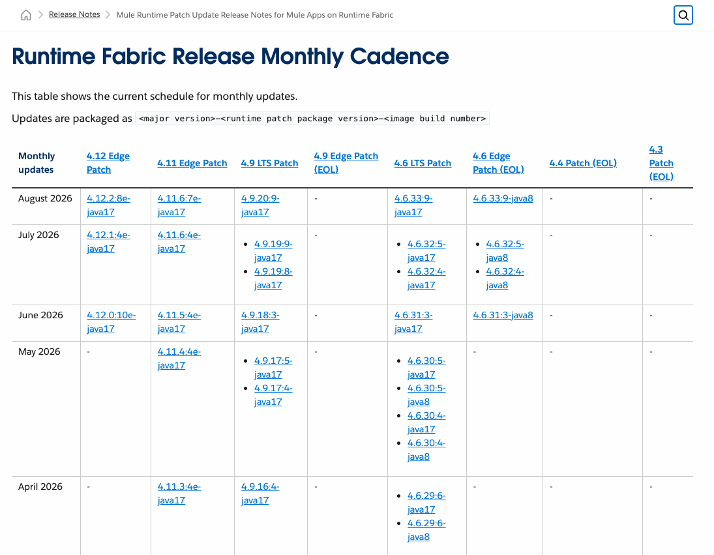
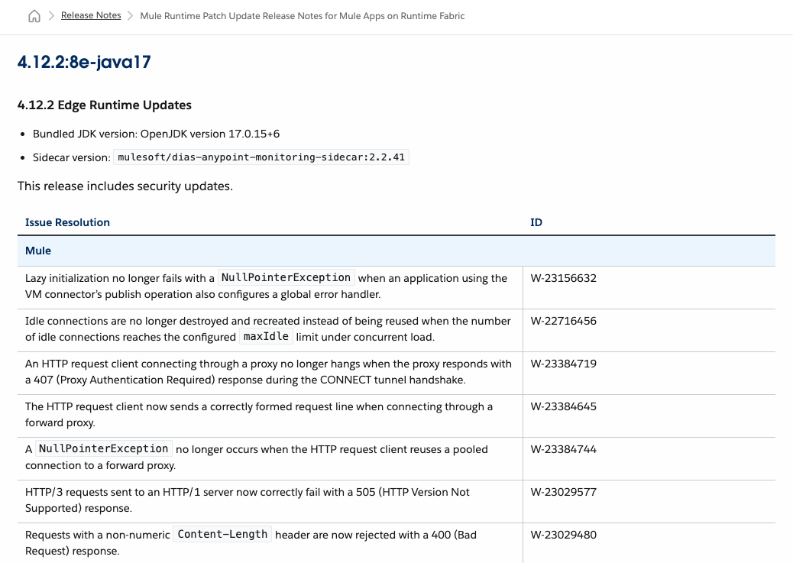

# Configure a Local Registry for Anypoint Runtime Fabric

## 1. Purpose

Configure Anypoint Runtime Fabric to use a local container registry for Runtime Fabric images instead of pulling images directly from MuleSoft-hosted registries.

This guide describes how to deploy a local container registry on the RHEL host, identify the required Runtime Fabric images, mirror them to the local registry, and configure Runtime Fabric to retrieve the mirrored images from that registry.

> [!IMPORTANT]
> This guide standardizes on Podman for running and managing the local container registry because the registry is hosted on Red Hat Enterprise Linux.
>
> MuleSoft documentation commonly uses Docker commands to pull, tag, and push Runtime Fabric images. Podman provides equivalent container image and registry operations, and this guide uses the corresponding `podman` commands throughout.

> [!NOTE]
> A local container registry is not required for the standard Runtime Fabric installation described in `03-install-rtf.md`. This configuration is intended for environments where direct access to the Runtime Fabric image registries is restricted or unavailable.

## 2. Prepare the Local Registry

Prepare a local container registry on the RHEL host to store the Runtime Fabric images mirrored from the MuleSoft-hosted registries.

The registry runs as a lightweight container managed by Podman on the RHEL host. Registry data is stored persistently on the host, and access to the registry is protected by TLS and authentication.

### 2.1 Install Podman and Registry Prerequisites

Install Podman and the utilities required to configure the local registry.

##### Procedure

```bash
sudo dnf install -y \
    podman \
    httpd-tools \
    openssl
```

##### Verification

Verify that the required tools are installed and available.

```bash
podman --version
command -v htpasswd
openssl version
```

Confirm that Podman and OpenSSL report their installed versions and that htpasswd is available.

### 2.2 Prepare the Registry Storage

Create the directories used to store the registry image data, authentication file, and TLS certificate. Registry image data is stored under `/data/registry`. Registry configuration files are stored separately under `/opt/rtf-registry`.

##### Procedure

Create the required directories.

```bash
sudo mkdir -p \
    /data/registry \
    /opt/rtf-registry/auth \
    /opt/rtf-registry/certs
```

Ensure the registry storage and configuration directories are owned by the administrative user.

```bash
sudo chown -R "$USER:$USER" \
    /data/registry \
    /opt/rtf-registry
```

##### Verification

Verify that the required directories exist and have the expected ownership.

```bash
ls -ld \
    /data/registry \
    /opt/rtf-registry \
    /opt/rtf-registry/auth \
    /opt/rtf-registry/certs
```

Confirm that:

- `/data/registry` exists and is owned by the administrative user.
- `/opt/rtf-registry/auth` and `/opt/rtf-registry/certs` exist and are owned by the administrative user.

### 2.3 Configure Registry Authentication

Create credentials used to authenticate to the local registry.

##### Procedure

```bash
htpasswd -Bc \
    /opt/rtf-registry/auth/htpasswd \
    rtf-registry
```

When prompted, enter and confirm a password for the `rtf-registry` user.

> [!IMPORTANT]
> The local registry password is sensitive. Store it securely. It will be required later when configuring Runtime Fabric to retrieve images from the local registry.

##### Verification

```bash
grep '^rtf-registry:' /opt/rtf-registry/auth/htpasswd | cut -d: -f1
```

Confirm that the command returns rtf-registry.

### 2.4 Configure Registry TLS

Configure TLS for the local registry. The TLS certificate must identify the RHEL host by the hostname used by the OKD cluster to reach the registry.

##### Procedure

```bash
openssl req \
    -newkey rsa:4096 \
    -nodes \
    -sha256 \
    -keyout /opt/rtf-registry/certs/registry.key \
    -x509 \
    -days 365 \
    -out /opt/rtf-registry/certs/registry.crt \
    -subj "/CN=orion.lan" \
    -addext "subjectAltName=DNS:orion.lan"
```

Restrict access to the registry private key.

```bash
chmod 600 /opt/rtf-registry/certs/registry.key
```

##### Verification

```bash
openssl x509 \
    -in /opt/rtf-registry/certs/registry.crt \
    -noout \
    -subject \
    -ext subjectAltName \
    -enddate
```

Confirm that the certificate identifies `orion.lan`, the Subject Alternative Name contains `DNS:orion.lan`, and the expiration date is approximately one year from the date it was generated.

> [!IMPORTANT]
> The self-signed certificate must be trusted by both the RHEL host and the OKD cluster before they can validate TLS connections to the local registry. The required trust configuration is completed later in this guide before Runtime Fabric retrieves images from the registry.

### 2.5 Start the Local Registry

##### Procedure

Pull the registry image.

```bash
podman pull docker.io/library/registry:2
```

Enable lingering for the administrative user so that the rootless registry can continue running independently of the user’s login session.

```bash
sudo loginctl enable-linger "$USER"
```

Create and start the registry container.

```bash
podman run -d \
    --name rtf-registry \
    --restart=unless-stopped \
    -p 5000:5000 \
    -v /data/registry:/var/lib/registry:Z \
    -v /opt/rtf-registry/auth:/auth:Z \
    -v /opt/rtf-registry/certs:/certs:Z \
    -e REGISTRY_AUTH=htpasswd \
    -e REGISTRY_AUTH_HTPASSWD_REALM="Registry Realm" \
    -e REGISTRY_AUTH_HTPASSWD_PATH=/auth/htpasswd \
    -e REGISTRY_HTTP_TLS_CERTIFICATE=/certs/registry.crt \
    -e REGISTRY_HTTP_TLS_KEY=/certs/registry.key \
    docker.io/library/registry:2
```

Open TCP port `5000` in the RHEL firewall.

```bash
sudo firewall-cmd --permanent --add-port=5000/tcp
sudo firewall-cmd --reload
```

##### Verification

```bash
loginctl show-user "$USER" -p Linger
podman ps --filter name=rtf-registry
ss -lnt | grep ':5000'
```

Confirm that lingering is enabled, the rtf-registry container is running, and TCP port 5000 is listening.

### 2.6 Configure the RHEL Host to Trust the Registry Certificate

Copy the registry certificate to the system trust anchors and update the trust store.

```bash
sudo cp \
    /opt/rtf-registry/certs/registry.crt \
    /etc/pki/ca-trust/source/anchors/rtf-registry.crt

sudo update-ca-trust
```

##### Verification

```bash
curl https://orion.lan:5000/v2/
```

Confirm that the request reaches the registry and returns UNAUTHORIZED with the message authentication required. A TLS certificate validation error must not occur.

### 2.7 Verify Registry Authentication and Image Storage

Verify that the local registry accepts authenticated image pushes and pulls and stores the image data persistently on the RHEL host.

##### Procedure

Sign in to the local registry.

```bash
podman login \
    orion.lan:5000 \
    --username rtf-registry
```

When prompted, enter the local registry password created in Section 2.3.

Pull and tag a small validation image.

```bash
podman pull docker.io/library/alpine:latest

podman tag \
    docker.io/library/alpine:latest \
    orion.lan:5000/validation/alpine:latest
```

Push the image to the local registry.

```bash
podman push \
    orion.lan:5000/validation/alpine:latest
```

Remove the locally tagged copy and retrieve it from the registry.

```bash
podman image rm \
    orion.lan:5000/validation/alpine:latest

podman pull \
    orion.lan:5000/validation/alpine:latest
```

##### Verification

```bash
podman images \
    orion.lan:5000/validation/alpine

sudo du -sh /data/registry
```

Confirm that the latest tag is present and that `/data/registry` contains registry data.

## 3. Synchronize the Required Images

> [!IMPORTANT]
> Commands in this section use credentials and authorization tokens. Be aware that commands containing sensitive values may be retained in shell history. Do not store them or their output in screenshots, shell scripts, documentation, or source-control repositories.

### 3.1 Runtime Fabric Images

Synchronize the Runtime Fabric 3.0.277 images required for OpenShift from the MuleSoft-hosted registry to the local registry.

##### Procedure

Get an Anypoint authorization token.

```bash
ANYPOINT_TOKEN=$(
  curl -sS -X POST \
    -H "Content-Type: application/json" \
    -d '{"username":"<username>","password":"<password>"}' \
    "https://anypoint.mulesoft.com/accounts/login" \
  | jq -r '.access_token'
)
```

Verify the token was obtained successfully.

```bash
test -n "$ANYPOINT_TOKEN" \
  && test "$ANYPOINT_TOKEN" != "null" \
  && echo "Authorization token obtained successfully."
```

Retrieve the OpenShift images required by Runtime Fabric 3.0.277.

```bash
RTF_IMAGE_LIST=$(
  curl -sS \
    "https://anypoint.mulesoft.com/runtimefabric/api/agentmanifests/3.0.277" \
    -H "Authorization: bearer ${ANYPOINT_TOKEN}" \
  | jq -r '.dependencies[]
      | select(.provider == "openshift")
      | "\(.artifact):\(.version)"'
)
```

Review the list before continuing.

```bash
printf '%s\n' "$RTF_IMAGE_LIST"
```

Example output:

```text
rtf-core-actions-ubi:1.0.219
dias-anypoint-monitoring-sidecar-ubi:2.2.36
rtf-cluster-ops-ubi:2.0.384
rtf-daemon-ubi:2.0.400
rtf-mule-clusterip-service-ubi:1.4.92
rtf-app-init-ubi:1.0.274
rtf-object-store-ubi:1.0.312
rtf-ubi-base-nginx:0.3.57
rtf-resource-fetcher-ubi:1.0.333
rtf-agent-ubi:3.0.277
```

Sign in to the MuleSoft Runtime Fabric registry.

```bash
podman login \
    rtf-runtime-registry.kprod.msap.io \
    --username '<docker-username>'
```

When prompted, enter the `docker-password` provided on the Runtime Fabric details page in Anypoint Runtime Manager.

Synchronize the images automatically.

```bash
for IMAGE in $RTF_IMAGE_LIST
do
    echo "Processing $IMAGE"
    podman pull rtf-runtime-registry.kprod.msap.io/mulesoft/$IMAGE
    podman tag \
        rtf-runtime-registry.kprod.msap.io/mulesoft/$IMAGE \
        orion.lan:5000/mulesoft/$IMAGE
    podman push orion.lan:5000/mulesoft/$IMAGE
done
```

##### Verification

Verify that each Runtime Fabric image in `RTF_IMAGE_LIST` is available in the local registry.

```bash
for IMAGE in $RTF_IMAGE_LIST
do
    REPOSITORY="${IMAGE%:*}"
    TAG="${IMAGE##*:}"

    printf 'Verifying %s ... ' "$IMAGE"

    if RESPONSE=$(curl -fsS \
        -u "rtf-registry:<registry-password>" \
        "https://orion.lan:5000/v2/mulesoft/${REPOSITORY}/tags/list")
    then
        if jq -e \
            --arg TAG "$TAG" \
            '.tags | index($TAG) != null' \
            <<< "$RESPONSE" \
            > /dev/null
        then
            echo "OK"
        else
            echo "FAILED"
        fi
    else
        echo "FAILED"
    fi
done
```

Confirm that the verification returns OK for all images.

### 3.2 Mule Runtime Images

Synchronize the Mule runtime and OpenShift-compatible Anypoint Monitoring sidecar images required to deploy Mule applications to Runtime Fabric.

Unlike the Runtime Fabric platform images synchronized in Section 3.1, Mule runtime images are not included in the Runtime Fabric agent manifest. Identify and synchronize the required images separately for each Mule runtime version that will be used for application deployments.

##### Procedure

Identify the Mule runtime version to synchronize using the [Mule Runtime Patch Update Release Notes for Mule Apps on Runtime Fabric](https://docs.mulesoft.com/release-notes/runtime-fabric/runtime-fabric-runtimes-release-notes).

Review the **Runtime Fabric Release Monthly Cadence** table and select the required Mule runtime package.

The table identifies runtime packages using the following format:

``` text
<mule-version>:<image-build>-<java-version>
```

For example, this guide uses the Mule runtime package `4.12.2:8e-java17`.



Construct the Mule runtime image name by prefixing the selected runtime package with `poseidon-runtime-`. For example, the Mule runtime package `4.12.2:8e-java17` uses the image name `poseidon-runtime-4.12.2:8e-java17`.

Select the link for the runtime package in the release notes and identify its associated Anypoint Monitoring sidecar version.

For `4.12.2:8e-java17`, the release notes identify sidecar version `2.2.41`.



Because Runtime Fabric is being installed on OpenShift, use the UBI variant of the Anypoint Monitoring sidecar image. For sidecar version `2.2.41`, use the image name `dias-anypoint-monitoring-sidecar-ubi:2.2.41`.

Define the list of images to synchronize.

```bash
MULE_IMAGE_LIST='poseidon-runtime-4.12.2:8e-java17
dias-anypoint-monitoring-sidecar-ubi:2.2.41'
```

Review the list before continuing.

```bash
printf '%s\n' "$MULE_IMAGE_LIST"
```

Synchronize both images.

```bash
for IMAGE in $MULE_IMAGE_LIST
do
    echo "Processing $IMAGE"
    podman pull rtf-runtime-registry.kprod.msap.io/mulesoft/$IMAGE
    podman tag \
        rtf-runtime-registry.kprod.msap.io/mulesoft/$IMAGE \
        orion.lan:5000/mulesoft/$IMAGE
    podman push orion.lan:5000/mulesoft/$IMAGE
done
```

##### Verification

Verify that the Mule runtime and OpenShift-compatible Anypoint Monitoring sidecar images are available in the local registry.

```bash
for IMAGE in $MULE_IMAGE_LIST
do
    REPOSITORY="${IMAGE%:*}"
    TAG="${IMAGE##*:}"

    printf 'Verifying %s ... ' "$IMAGE"

    if RESPONSE=$(curl -fsS \
        -u "rtf-registry:<registry-password>" \
        "https://orion.lan:5000/v2/mulesoft/${REPOSITORY}/tags/list")
    then
        if jq -e \
            --arg TAG "$TAG" \
            '.tags | index($TAG) != null' \
            <<< "$RESPONSE" \
            > /dev/null
        then
            echo "OK"
        else
            echo "FAILED"
        fi
    else
        echo "FAILED"
    fi
done
```

Confirm that the verification returns OK for all images.

Sign out of the MuleSoft Runtime Fabric registry.

```bash
podman logout rtf-runtime-registry.kprod.msap.io
```

Clear the authorization token.

```bash
unset ANYPOINT_TOKEN
```

## 4. Configure OKD to Trust the Local Registry

Configure OKD to trust the self-signed certificate used by the local container registry.

### 4.1 Add the Registry Certificate to OKD

Add the local registry certificate to the OKD cluster and configure the cluster-wide image configuration to trust it.

##### Procedure

Create a ConfigMap containing the local registry certificate in the `openshift-config` namespace.

```bash
oc create configmap registry-ca \
    --namespace openshift-config \
    --from-file=orion.lan..5000=/opt/rtf-registry/certs/registry.crt
```

Configure the cluster-wide image configuration to use the ConfigMap as an additional trusted certificate authority.

```bash
oc patch image.config.openshift.io/cluster \
    --type=merge \
    --patch '{"spec":{"additionalTrustedCA":{"name":"registry-ca"}}}'
```

##### Verification

Verify that the cluster-wide image configuration references the `registry-ca` ConfigMap.

```bash
oc get image.config.openshift.io/cluster \
    -o jsonpath='{.spec.additionalTrustedCA.name}{"\n"}'
```

Confirm that the command returns `registry-ca`.

Verify that the MachineConfigPool has completed applying the configuration and that the OKD node is ready.

```bash
oc get machineconfigpools
oc get nodes
```

Confirm that the `master` MachineConfigPool reports `UPDATED=True`, `UPDATING=False`, and `DEGRADED=False`, and that the OKD node reports `Ready`.

### 4.2 Verify Registry Access from OKD

Verify that OKD can authenticate to the local registry, trust its TLS certificate, and pull an image from the registry.

##### Procedure

Create a temporary namespace for validating access to the local registry.

```bash
oc create namespace registry-test
```

Create a temporary pull secret containing the local registry credentials.

```bash
oc create secret docker-registry registry-test-pull-secret \
    --namespace registry-test \
    --docker-server=orion.lan:5000 \
    --docker-username=rtf-registry \
    --docker-password='<registry-password>'
```

Create a validation pod that retrieves the Alpine image previously stored in the local registry.

```bash
oc run registry-test \
    --namespace registry-test \
    --image=orion.lan:5000/validation/alpine:latest \
    --restart=Never \
    --overrides='
{
  "spec": {
    "imagePullSecrets": [
      {
        "name": "registry-test-pull-secret"
      }
    ],
    "containers": [
      {
        "name": "registry-test",
        "image": "orion.lan:5000/validation/alpine:latest",
        "command": ["sleep", "300"],
        "securityContext": {
          "allowPrivilegeEscalation": false,
          "capabilities": {
            "drop": ["ALL"]
          },
          "runAsNonRoot": true,
          "seccompProfile": {
            "type": "RuntimeDefault"
          }
        }
      }
    ]
  }
}'
```

##### Verification

Verify that the validation pod is running.

```bash
oc get pod registry-test \
    --namespace registry-test
```

Confirm that the pod reports `Running`.

Verify that the image used by the pod was retrieved from the local registry.

```bash
oc get pod registry-test \
    --namespace registry-test \
    -o jsonpath='{.status.containerStatuses[0].imageID}{"\n"}'
```

Confirm that the image ID begins with `orion.lan:5000/validation/alpine@sha256:`.

Delete the temporary validation resources.

```bash
oc delete namespace registry-test
```

## 5. Install Anypoint Runtime Fabric Using the Local Registry

> [!NOTE]
> This installation procedure follows the same general process described in `03-install-rtf.md`, with the changes required when using a local registry. The complete procedure is repeated here so that this guide can be followed sequentially without switching between documents.

### 5.1 Create the Runtime Fabric Namespace

On the RHEL host, create a namespace for installing Runtime Fabric.

```bash
oc create ns rtf
```

### 5.2 Create the Registry Pull Secrets

Create the registry credentials required to pull the Runtime Fabric platform images and the certified Runtime Fabric Operator bundle.

> [!IMPORTANT]
> Commands in this section contain registry credentials. Be aware that commands containing credentials may be retained in shell history. Do not store them in screenshots, shell scripts, documentation, or source-control repositories.

##### Procedure

<!-- LOCAL REGISTRY CHANGE - BEGIN -->
###### Create the Local Registry Pull Secret

Create the pull secret used to retrieve the Runtime Fabric and Mule Runtime images.

```bash
oc create secret docker-registry local-registry-pull-secret \
    --namespace rtf \
    --docker-server=orion.lan:5000 \
    --docker-username='<local-registry-username>' \
    --docker-password='<local-registry-password>'
```
<!-- LOCAL REGISTRY CHANGE - END -->

###### Create the Red Hat Registry Pull Secret

Create the pull secret used to retrieve the certified Runtime Fabric Operator bundle.

```bash
oc create secret docker-registry redhat-connect-pull-secret \
    --namespace rtf \
    --docker-server=registry.connect.redhat.com \
    --docker-username='<red-hat-username>' \
    --docker-password='<red-hat-password>'
```

Link the Red Hat registry pull secret to the default service account.

```bash
oc secrets link default \
    redhat-connect-pull-secret \
    --for=pull \
    --namespace rtf
```

##### Verification

Verify that both registry pull secrets exist.

```bash
oc get secrets \
    local-registry-pull-secret \
    redhat-connect-pull-secret \
    --namespace rtf
```

Example output:

```text
NAME                         TYPE                             DATA   AGE
local-registry-pull-secret   kubernetes.io/dockerconfigjson   1      ...
redhat-connect-pull-secret   kubernetes.io/dockerconfigjson   1      ...
```

Verify that the Red Hat registry pull secret is linked to the default service account.

```bash
oc get serviceaccount default \
    --namespace rtf \
    -o jsonpath='{.imagePullSecrets[*].name}{"\n"}'
```

Confirm that the output includes `redhat-connect-pull-secret`.

### 5.3 Install the Runtime Fabric Operator

Install the certified Runtime Fabric Operator bundle using Operator SDK.

> [!NOTE]
> MuleSoft’s OpenShift procedure installs the Runtime Fabric Operator from the Red Hat OperatorHub catalog. Because OKD does not include the Red Hat certified operator catalog, this guide installs the certified operator bundle through the Operator Lifecycle Manager using `operator-sdk`.

##### Procedure

Sign in to the Red Hat registry so that operator-sdk can retrieve the Runtime Fabric Operator bundle.

```bash
podman login \
    registry.connect.redhat.com \
    --username '<red-hat-username>' \
    --password '<red-hat-password>'
```

Install the Runtime Fabric Operator bundle.

```bash
operator-sdk run bundle \
    registry.connect.redhat.com/rtf/runtime-fabric-operator:3.0.277-1785441385 \
    --namespace rtf \
    --pull-secret-name redhat-connect-pull-secret \
    --timeout 10m
```

The command creates the Operator Lifecycle Manager resources required to install the operator.

Sign out of the Red Hat registry after the operator installation completes.

```bash
podman logout registry.connect.redhat.com
```

##### Verification

Verify that the Runtime Fabric Operator ClusterServiceVersion (CSV) reports `Succeeded`.

```bash
oc get csv \
    --namespace rtf
```

Example output:

```text
NAME                                      DISPLAY                   VERSION   REPLACES   PHASE
runtime-fabric-operator.v3.0.277          Runtime Fabric Operator   3.0.277              Succeeded
```

Verify that the operator pod is running.

```bash
oc get pods \
    --namespace rtf
```

Confirm that the Runtime Fabric Operator pod reports `Running` and all its containers are ready.

### 5.4 Gather the Installation Information

Gather the following information and collect it into a temporary scratchpad or plain text file.

<!-- LOCAL REGISTRY CHANGE - BEGIN -->
- Local registry URL and port
- Local registry pull secret name
- OKD web console URL
- `kubeadmin` password
- Runtime Fabric Activation Data
- Base64-encoded Mule license
<!-- LOCAL REGISTRY CHANGE - END -->

##### Procedure

On the RHEL host, retrieve the OKD web console URL.

```bash
oc whoami --show-console
```

Retrieve the `kubeadmin` password.

```bash
cat ~/Work/rtf-on-okd/cluster/auth/kubeadmin-password
```

In Runtime Manager, open the Runtime Fabric created in Section 5 and copy the **Activation Data** displayed on the Runtime Fabric details page.

On your local Linux or Unix workstation, encode the Mule license file as a single-line Base64 value.

```bash
base64 < license.lic | tr -d '\n'
```

Copy the displayed value. It will be used when creating the Runtime Fabric instance.

> [!IMPORTANT]
> The Runtime Fabric activation data, Mule license, and registry credentials are sensitive. Do not store them in screenshots, shell scripts, documentation, or source-control repositories.

### 5.5 Create the Runtime Fabric Instance

Create a Runtime Fabric instance using the Runtime Fabric Operator.

##### Procedure

Open the OKD web console URL in a browser and sign in as `kubeadmin`.

In the left navigation menu, expand **Ecosystem** and select **Installed Operators**.

Select the **Runtime Fabric Operator**.

On the **Details** tab, select **Create instance** in the Runtime Fabric tile.

On the **Create RuntimeFabric** page, use **Form view** and configure the following values:

- **Name:** `orion-okd-rtf`
- **activationData:** Paste the Runtime Fabric Activation Data.
- **muleLicense:** Paste the Base64-encoded contents of the Mule license file.

<!-- LOCAL REGISTRY CHANGE - BEGIN -->
Expand **global**, scroll to **image**, and expand it.

Configure the following values:

- **rtfRegistry:** `orion.lan:5000/mulesoft`
- **pullSecretName:** `local-registry-pull-secret`
<!-- LOCAL REGISTRY CHANGE - END -->

Leave all other values at their defaults.

Select **Create**.

After creating the Runtime Fabric instance, continue with **Section 6, Validate the Runtime Fabric Installation**, and **Section 7, Back Up the Validated Runtime Fabric Installation**, in `03-install-rtf.md`.

> [!IMPORTANT]
> After creating the Runtime Fabric instance, close the temporary scratchpad without saving it, or delete the temporary plain text file. It contains sensitive information, including the kubeadmin password, Runtime Fabric activation data, and the Base64-encoded Mule license.

---

Copyright © 2026 Alan Belisle. Licensed under the [MIT License](../LICENSE).
